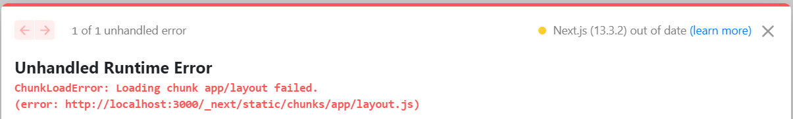

# RoamRental | Airbnb Clone

RoamRental is a unique and innovative platform that connects travelers with exceptional accommodations around the world. Whether you're a globetrotter seeking an unforgettable adventure or a weekend wanderer looking for a cozy getaway, RoamRental offers a diverse selection of handpicked properties to suit every style and preference.

With our user-friendly interface and personalized recommendations, finding the perfect place to stay has never been easier. Embrace the freedom to roam and discover your dream destination with RoamRental, where memorable experiences begin

## Introduction

The purpose of this project is to provide a fully functional Airbnb clone that can be used as a starting point for building similar applications.The project is built with popular technologies and frameworks, making it easy to understand and extend.

## Technologies Used


The following technologies were used in this project:

- [Next.js 13 App Router](#nextjs-13-app-router)
- [React](#react)
- [Tailwind CSS](#tailwind-css)
- [Prisma](#prisma)
- [MongoDB](#mongodb)
- [NextAuth](#nextauth)
- [Mapbox](#mapbox)

## Features

- User authentication with NextAuth
- Search functionality with Mapbox
- Booking functionality
- User dashboard with booking history
- Responsive design with Tailwind CSS

## What I Learned

- How to use Next.js 13 App Router
- How to use NextAuth for user authentication
- How to use Mapbox for search functionality
- How to use Prisma with MongoDB
- How to use query-string for parsing URL query strings
- How to use date-fns and react-date-range for date formatting and creating more suitable calendar component.

## Plans for the Future

- Add more features
- Integrate with a payment provider (e.g. Stripe)
- Add more details to the listings (e.g. amenities, reviews, etc.)

## Screenshots


## How to Setup

1. Clone the repository
2. Install dependencies with `npm install`
3. Create a `.env` file and add the required environment variables (see `.env.example` for an example)
4. Start the development server with `npm run dev`
5. Open `http://localhost:3000` in your browser

## Conclusion

This project provides a solid foundation for building Airbnb-like applications with Next.js, React, Tailwind CSS, Prisma, MongoDB, and NextAuth. By following along with the tutorial, you'll gain a better understanding of these technologies and how they can be used together to build complex applications.

## Credits

This project was created by [Code With Antonio](https://www.youtube.com/@codewithantonio).Tutorial video for this project can be found on the [Code With Antonio YouTube channel](https://youtu.be/c_-b_isI4vg). Thank you for the great tutorial!

## Tips & Tricks

### Next.js 13 App Router

- We have to mark some components as client components. This is something we have to do with when we work with `app` folder. Because every page and component we create inside the app folder, is a `server component` by default.

- `Hydration problems` - When you have a component that is a server component, and you try to import a component that is a client component, you can run into problems.

- That can lead to hydration problems if you mix and match imports with client and server components.

- At the top of client components, we add `use client` to make sure that we are using client components.



- There is a bug in Next.js (current version: 13.3.2) `experimental app directory`, if we click something on the website (basically an interaction) while reloding, it triggers a `hydration error`. This is a known bug and will be fixed in the future. By the time being, use following code to fix this issue:

1. Create a file called `ClientOnly.tsx` inside the `components` folder.

2. Copy and paste the following code inside the `ClientOnly.tsx` file:

```
"use client";
import { useEffect, useState } from "react";

interface ClientOnlyProps {
  children: React.ReactNode;
}

const ClientOnly: React.FC<ClientOnlyProps> = ({ children }) => {
  const [hasMounted, setHasMounted] = useState(false);

  useEffect(() => {
    setHasMounted(true);
  }, []);

  if (!hasMounted) {
    return null;
  }

  return <>{children}</>;
};

export default ClientOnly;

```

3. Wrap the component that is causing the hydration error with the `ClientOnly` component. For example: In this case we are wrapping `Navbar` component.

```
<ClientOnly>
    <Navbar />
</ClientOnly>
```

## NPM PACKAGES USED

### query-string

The query-string npm package is used to parse and stringify URL query strings.

- A simple and lightweight query string parser with zero dependencies.
- Provides a consistent and well-documented API for working with query strings.
- Flexible, allowing you to use it in a variety of ways including HTML forms, HTTP requests, and URL parameters.
- Hence, it reduces errors and imporve code readability.

Read more about [query-string](https://www.npmjs.com/package/query-string)

The following code shows how to use the query-string npm package to parse a URL query string:

```js
const query = require("query-string");
const url = "https://example.com/?q=foo&bar=bar";
const params = query.parse(url);
console.log(params);
```

Following code shows example of how to parse a URL query string using the built-in JavaScript URL object:

```js
const url = "https://example.com/?q=foo&bar=bar";
const urlObj = new URL(url);
const params = Object.fromEntries(urlObj.searchParams);
console.log(params);
```

Output:

```js
{
  q: 'foo',
  bar: 'bar'
}
```

As you can see, the traditional approach to parsing URL query strings is more verbose and requires more code.

### react-leaflet, leaflet

The react-leaflet npm package is used to render a map with Leaflet. The leaflet is one of the most popular open-source JavaScript libraries for interactive maps.
However, the leaflet library is not compatible with React. The react-leaflet npm package provides a React-friendly API wrapper around the leaflet library.
We have to do some neccessary changes in order to make it work with Next.js.

Read more about [react-leaflet](https://www.npmjs.com/package/react-leaflet)
Read more about [leaflet](https://www.npmjs.com/package/leaflet)

It is used in `Map` component in this project. In additional, we have to change some css properties. The changes are available in `global.css` file.

```css
.leaflet-bottom,
.leaflet-control,
.leaflet-pane,
.leaflet-top {
  z-index: 0 !important;
}
```
